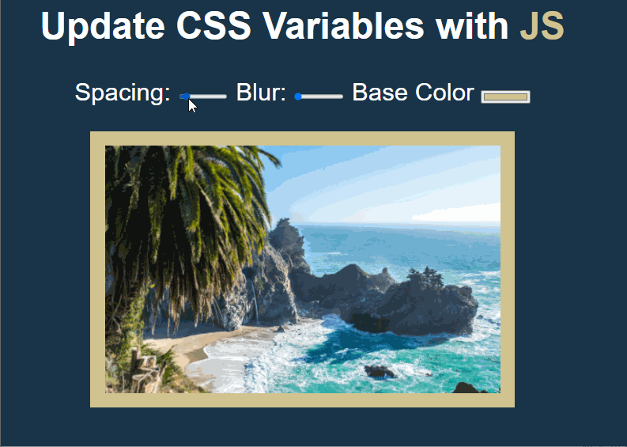

# Spacing, Blur and Color Picker with CSS

<html>
<!-- Project Shields -->
    

        
		  ¨
        
        ¨
        
        ¨
        
        ¨
        
    
 
</html>

### Changing CSS values: spacing, picture blur property and base color.

\

#### By Roman Kolivashko

## Technologies Used

* _HTML_
* _CSS_
* _JavaScript ES6_

## Description
This app demonstrates how easy it is to manipulate CSS values with JS variables. 

## Setup/Installation Requirements

1. Click on "Code" button at top of GitHub repository. 
2. Clone the repository: `$ git clone https://github.com/romankolivashko/css-variables.git`
3. Navigate to the css-variables/ directory on your computer
4. Launch index.html in any browser 

## How to access the app from the web and hear the sound of a drum
* Follow the link [here](https://ecstatic-mccarthy-d22692.netlify.app/)
## Known Bugs

* _None so far_

## License
MIT
## Contact Information
rkolivashko@gmail.com